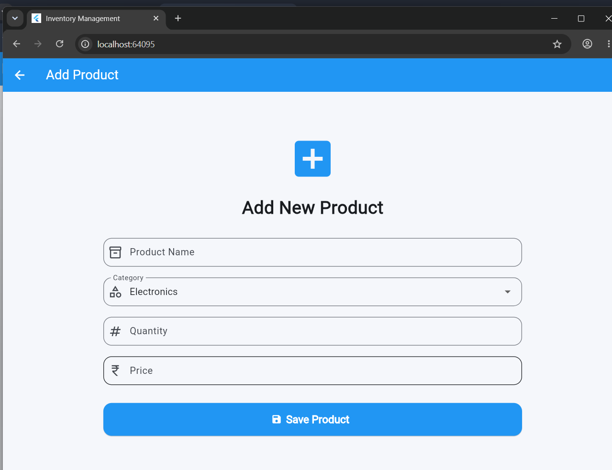
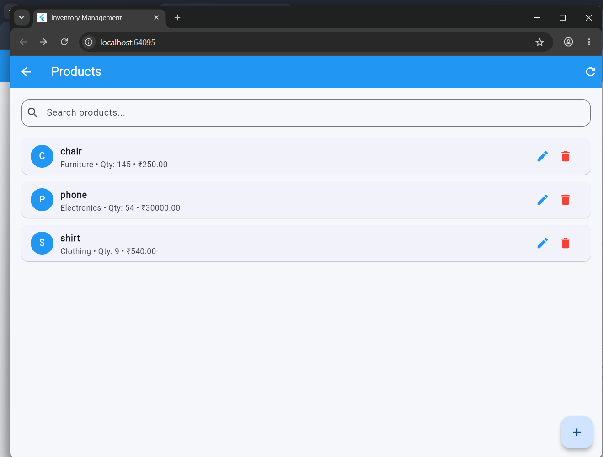
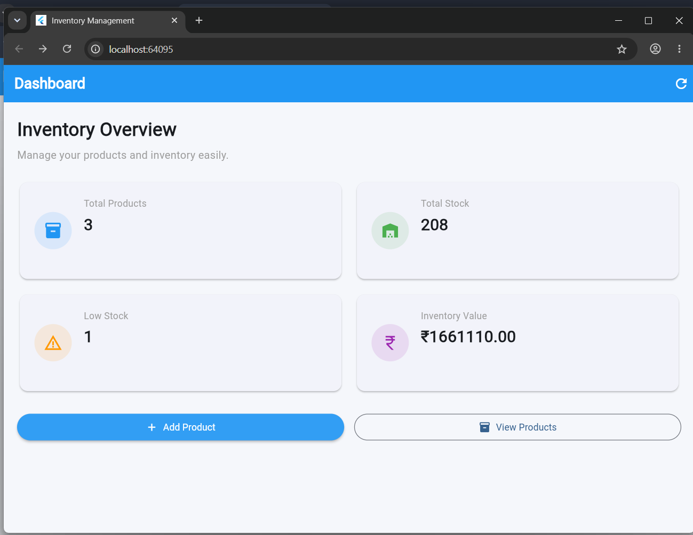

# Inventory Management System

A Flutter-based inventory management application designed to manage products, suppliers, and stock efficiently.

## Features

- Product management
- Supplier management
- Stock management
- CRUD operations
- User profile management
- Responsive user interface
- Database integration

## Technologies Used

- Flutter
- Dart
- MySQL
- Figma
- Git & GitHub

## Project Highlights

- Designed the UI using Figma.
- Implemented responsive screens using Flutter.
- Added CRUD operations for inventory data.
- Structured data for efficient product, supplier, and stock management.

## Project Structure

- `lib/screens` – Application screens
- `lib/widgets` – Reusable UI components
- `lib/models` – Data models
- `lib/services` – Database/API services
- `lib/theme` – Application theme
- `assets` – Images and other resources

## How to Run

1. Clone the repository.
2. Open the project in Android Studio or VS Code.
3. Run `flutter pub get`.
4. Connect an Android device or start an emulator.
5. Run `flutter run`.

## Screenshots

